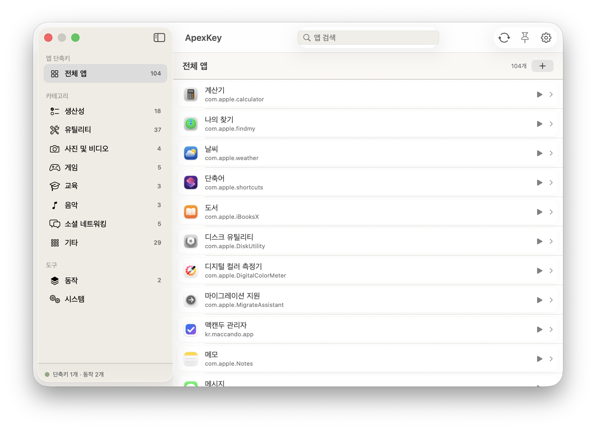

<div align="center">

# ⌘ ApexKey

**전역 핫키 기반 macOS 메뉴바 런처 — 어떤 앱의 메뉴 명령도 단축키로.**

[English](README.md) · [Landing Page](https://borasarang.github.io/ApexKey/ko/)


[](https://github.com/BoraSarang/ApexKey/releases)



</div>

---

## 소개

ApexKey는 **메뉴바에 상주**하며, 화면 어디에서나 전역 단축키로 다른 앱의 **메뉴 명령을 바로 실행**할 수 있게 해주는 macOS 유틸리티입니다.

- 실행 중인 앱의 **메뉴를 열거**해 그중 원하는 명령에 **글로벌 핫키를 지정**
- 앱 실행·토글, **URL scheme 열기**, 나만의 **동작(단계 조합)**, **시스템 액션**, 스크립트 실행 지원
- **메뉴 단축키 HUD** — 현재 앱의 모든 단축키를 한눈에 표시
- 8가지 내장 테마 + 라이트/다크/시스템 + 외형 모드 자동 전환

## 정의

**ApexKey는 macOS용 메뉴바 커맨드 덱입니다 — 단축키 한 방으로 무엇이든 실행합니다.**

- **앱 제어** — 앱 실행·토글, 화면 어디서나 다른 앱의 메뉴 명령 실행
- **워크플로우** — 단계(스크립트·키·클릭·조건·변수)를 쌓아 하나의 단축키로
- **메뉴 HUD** — 전면 앱의 모든 단축키를 한눈에
- **자동화** — 시간·폴더·배터리·충전기 트리거가 워크플로우를 대신 실행

보조: 시스템 프리셋, 커맨드 팔레트, 클립보드 히스토리, URL 스킴, 테마. AI 액션은 쳐다보지도 않음.

## 주요 기능

| 영역 | 기능 |
|------|------|
| **메뉴 명령 단축키** | 실행 중인 앱의 메뉴 항목에 전역 단축키 할당 → 어디서든 실행 |
| **앱 실행/토글** | 특정 앱을 실행·포커스·토글하는 단축키 |
| **URL Scheme** | `scheme://` 열기 단축키 |
| **동작(Shortcut) 스테이션** | 앱 열기·키 입력·스크립트·붙여넣기·대기·클릭 등을 **단계**로 쌓아 하나의 동작으로 |
| **흐름 제어** | If/반복/메뉴 선택, 변수, 출력-변수 연결 |
| **자동화** | 시간·폴더·배터리·충전기 조건 기반 트리거 (파일·디스플레이·Wi-Fi·블루투스·앱 등은 준비 중) |
| **AI 실행** | *(미구현 — FoundationModels 연동 후 제공 예정. 카탈로그에 표시되나 실행 시 실패합니다)* |
| **시스템 액션** | 잠금, 볼륨, 다크 모드 등 |
| **메뉴 단축키 HUD** | 전체화면/플로팅으로 현재 앱 단축키 표시, 서브메뉴 제자리 전개 + breadcrumb |
| **메뉴바 아이콘** | 상태 아이콘 전부 그리드 표시(노치 뒤 숨은 것 포함) — `⌥⌘]`로 열어 실제 아이콘 클릭 |
| **첫 실행 가이드** | 2분 설정: 권한 + 단축키 확인, 즉시 실행해보기 포함 |
| **단축키 안전장치** | macOS 시스템 단축키 겹침 경고(이동/강행/취소), 실행 실패 시 원인 토스트 |
| **테마** | 라이트·다크·네온·노드·페이퍼·터미널·오사우루스 등 8종 내장 + 폰트 크기 조절 |

## 설치

### 수동 설치

1. [Releases](https://github.com/BoraSarang/ApexKey/releases)에서 최신 `.dmg` 또는 `.zip` 다운로드
2. 다운로드한 `ApexKey` 앱을 `응용 프로그램` 폴더로 이동
3. **첫 실행은 우클릭 → 열기**로 실행하세요. (아래 "서명 상태" 참고)
4. **시스템 설정 → 개인정보 보호 → 손쉬운 사용**에서 ApexKey 허용 (메뉴 열거·실행에 필요)

> **요구사항**: macOS 14(Sonoma) 이상 · Apple Silicon 또는 Intel

### ⚠️ 서명 상태 — 현재 릴리스는 코드 서명이 없습니다

ApexKey는 아직 **Apple Developer Program에 가입하지 않아 배포본이 코드 서명·공증(notarization)되지 않습니다.**
그 결과 두 가지 불편이 있습니다.

| 증상 | 대응 |
|---|---|
| 첫 실행 시 Gatekeeper가 앱을 차단 | **우클릭 → 열기**로 실행하면 우회됩니다. 이것은 정상 동작입니다 |
| **새 버전으로 업데이트할 때마다** 손쉬운 사용 권한을 다시 승인해야 함 | 시스템 설정 → 개인정보 보호 → 손쉬운 사용에서 ApexKey를 다시 켜세요 |

두 번째 증상이 특히 불편한데, 원인은 기술적입니다. macOS의 접근성 권한은 앱의 **코드 서명(CDHash)** 에
연결되는데, 서명이 없는 앱은 버전마다 이 값이 바뀌어 권한이 자동 해제됩니다.
Developer ID로 서명·공증하면 사라지는 증상입니다.

> 소스에서 직접 빌드하면 자동 서명이 적용되어 **리빌드해도 권한이 유지**됩니다.

## 사용법

- 메뉴바의 ApexKey 아이콘으로 패널 열기 (기본 단축키 `⇧⌥A`)
- 앱 상세에서 **메뉴 명령에 `+`** 를 눌러 글로벌 단축키 녹음
- **메뉴 단축키 HUD** (`⇧⌥S`)로 현재 앱의 단축키 목록 확인
- **메뉴바 아이콘** (`⌥⌘]`)으로 노치 뒤 숨은 아이콘까지 클릭
- **동작** 탭에서 여러 단계를 조합해 나만의 동작 생성
- 설정의 각 기능 탭에 **▶ 직접 실행** 버튼 — 외우기 전에 단축기가 뭘 하는지 확인

## 빌드 (개발자)

```bash
# 1. xcodegen 설치 (필요시)
brew install xcodegen

# 2. 프로젝트 생성
xcodegen generate --spec project.yml

# 3. 빌드 + 테스트 (build_and_run.sh)
./build_and_run.sh debug macos
./build_and_run.sh test macos unit
```

> `.xcodeproj`는 커밋에 포함되지 않으며 `xcodegen`으로 생성합니다. `build_and_run.sh test`는 smoke/unit/full 스코프를 지원합니다.

## 문서

- [변경 이력](docs/CHANGELOG.md)
- [할 일(TODO)](docs/TODO.md)
- [기능 점검 리스트](docs/FUNCTIONAL_CHECKLIST.md)
- [디자인 명세](docs/DESIGN.md)

## 라이선스

이 프로젝트의 코드는 [MIT](LICENSE) 라이선스로 배포됩니다.

## 감사의 말

- 테마 디자인 시스템 아이디어는 **Osaurus** 오픈소스에서 영감을 받았습니다.
- 셉터 아이콘은 SF Symbols(`command`, `bolt.fill`, `square.stack.3d.up.fill` 등)를 사용합니다.

---

<div align="center">
  <sub>Built with SwiftUI · AppKit · Carbon · XcodeGen</sub><br>
  <sub>© 2026 BoraSarang</sub>
</div>
