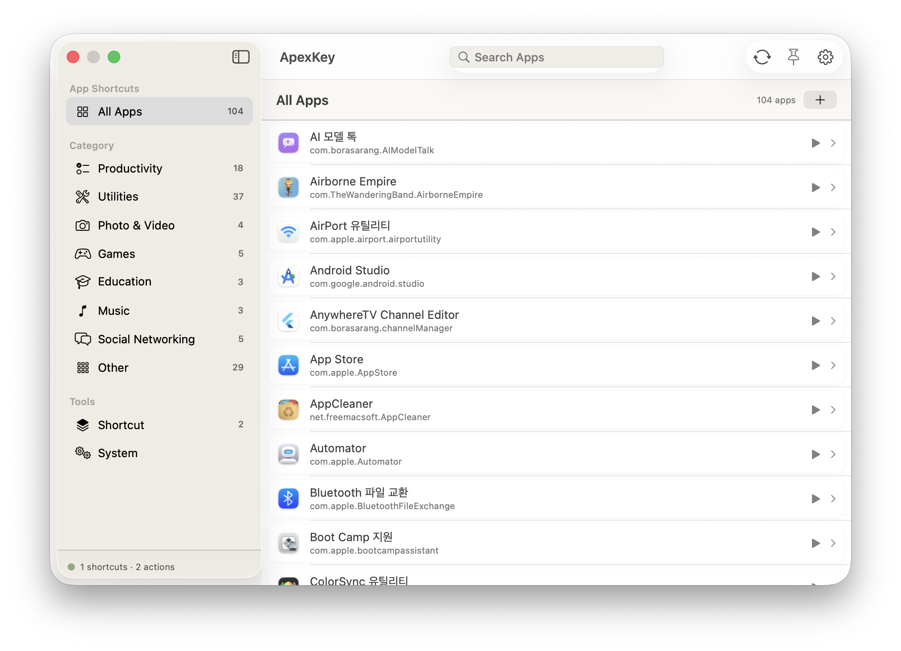

<div align="center">

# ⌘ ApexKey

**A global-hotkey macOS menu bar launcher — trigger any app's menu command with a shortcut.**

[한국어](README.ko.md) · [Landing Page](https://borasarang.github.io/ApexKey/)


[](https://github.com/BoraSarang/ApexKey/releases)



</div>

---

## What is ApexKey?

ApexKey sits in your **menu bar** and lets you trigger any app's **menu command** with a **global keyboard shortcut** — from anywhere on screen.

- **Enumerates menus** of running apps and lets you assign **global hotkeys** to any command
- App launch/toggle, **URL scheme**, custom **Shortcut Station** actions, **system actions**, and script execution
- **Menu Shortcut HUD** — see every shortcut of the frontmost app at a glance
- 8 built-in themes + Light/Dark/System auto-switching

## Features

| Area | Description |
|------|-------------|
| **Menu command shortcuts** | Assign a global shortcut to a menu item of a running app → execute from anywhere |
| **App launch / toggle** | Shortcut to launch, focus, or toggle a specific app |
| **URL scheme** | Shortcut to open `scheme://` |
| **Shortcut Station** | Chain **steps** — open app, key input, script, paste, wait, click — into one action |
| **Flow control** | If / repeat / menu choice, variables, output-to-variable |
| **Automation** | Time, folder, display, wifi, bluetooth, battery, charger, app triggers |
| **AI actions** | Use model, writing tool, image playground steps |
| **System actions** | Lock, volume, dark mode, and more |
| **Menu HUD** | Fullscreen / floating view of the current app's shortcuts |
| **Themes** | 8 built-in presets (Light, Dark, Neon, Nord, Paper, Terminal, Osaurus) + font scaling |

## Installation

### Manual

1. Download the latest `.dmg` or `.zip` from [Releases](https://github.com/BoraSarang/ApexKey/releases)
2. Move `ApexKey` to your `Applications` folder
3. Grant **System Settings → Privacy & Security → Accessibility** (required to read & execute menus)

> **Requirements**: macOS 14 (Sonoma) or later · Apple Silicon or Intel

## Usage

- Open the panel via the ApexKey menu bar icon (default `⇧⌥A`)
- In an app's detail view, press **`+`** on any menu command to record a global shortcut
- Press **Menu Shortcut HUD** (`⇧⌥S`) to view the frontmost app's shortcuts
- Use the **Shortcuts** tab to combine multiple steps into your own action

## Build (for developers)

```bash
# 1. Install xcodegen if needed
brew install xcodegen

# 2. Generate the project
xcodegen generate --spec project.yml

# 3. Build & test (via build_and_run.sh)
./build_and_run.sh debug macos
./build_and_run.sh test macos unit
```

> The `.xcodeproj` is not committed; it is generated with `xcodegen`. `build_and_run.sh test` supports `smoke`/`unit`/`full` scopes.

## Docs

- [Changelog](docs/CHANGELOG.md)
- [TODO](docs/TODO.md)
- [Functional checklist](docs/FUNCTIONAL_CHECKLIST.md)
- [Design spec](docs/DESIGN.md)

## License

The code in this project is released under the [MIT](LICENSE) license.

## Credits

- Theme design system inspired by the **Osaurus** open-source project.
- SF Symbols icons (`command`, `bolt.fill`, `square.stack.3d.up.fill`, etc.).

---

<div align="center">
  <sub>Built with SwiftUI · AppKit · Carbon · XcodeGen</sub><br>
  <sub>© 2026 BoraSarang</sub>
</div>
