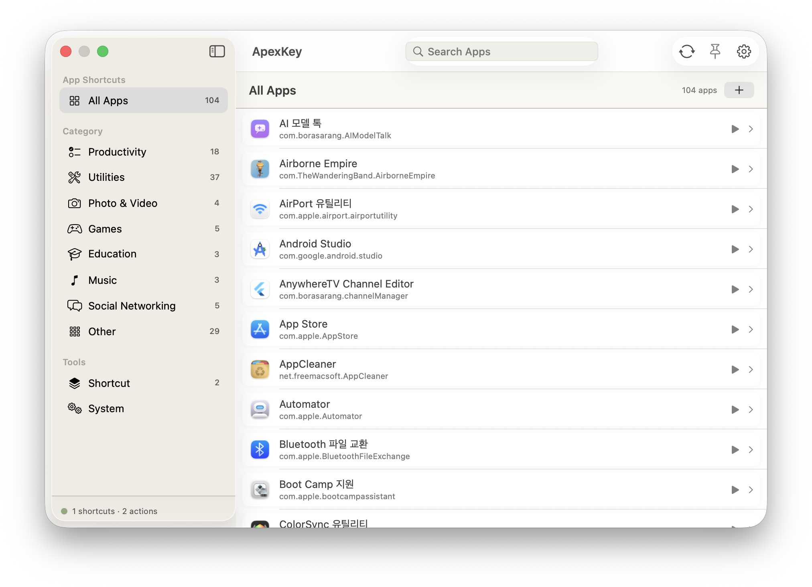

<div align="center">

# ⌘ ApexKey

**A global-hotkey macOS menu bar launcher — trigger any app's menu command with a shortcut.**

[한국어](README.ko.md) · [Landing Page](https://borasarang.github.io/ApexKey/)


[](https://github.com/BoraSarang/ApexKey/releases)



</div>

---

## What is ApexKey?

ApexKey sits in your **menu bar** and lets you trigger any app's **menu command** with a **global keyboard shortcut** — from anywhere on screen.

- **Enumerates menus** of running apps and lets you assign **global hotkeys** to any command
- App launch/toggle, **URL scheme**, custom **Shortcut Station** actions, **system actions**, and script execution
- **Menu Shortcut HUD** — see every shortcut of the frontmost app at a glance
- **Menu Bar Icons** — every status icon in one grid, even notch-hidden ones
- 8 built-in themes + Light/Dark/System auto-switching

## Definition

**ApexKey is a menu-bar command deck for macOS — run anything with a global hotkey.**

- **App control** — launch/toggle apps, trigger any app's menu command from anywhere
- **Workflows** — chain steps (scripts, keys, clicks, conditions, variables) into one shortcut
- **Menu HUD** — every shortcut of the frontmost app at a glance
- **Automation** — time/folder/battery/charger triggers run workflows for you

Supporting: system presets, command palette, clipboard history, URL scheme, themes. AI actions are not on the table.

## Features

| Area | Description |
|------|-------------|
| **Menu command shortcuts** | Assign a global shortcut to any menu item of a running app → execute from anywhere; failures toast the reason |
| **App launch / toggle** | Shortcut to launch, focus, or toggle a specific app |
| **URL scheme** | Shortcut to open `scheme://` |
| **Command palette** | Keyboard-first launcher for workflows, apps, and commands (`⌘⌥K`) |
| **Clipboard history** | `⌘⇧V` — last 100 clips / 30 days, with image previews |
| **Instant Send** | `⌃⌥D` — selected text straight into a workflow as input |
| **Shared hotkeys** | One combo, many targets — a picker with pinning when combos collide |
| **Shortcut Station** | Chain **steps** — open app, key input, script, paste, wait, click — into one action (59 of 162 catalog actions fully wired; the rest read "Coming soon") |
| **Flow control** | If / repeat / menu choice, variables, output-to-variable |
| **Automation** | Time, folder, battery and charger triggers (display, wifi, bluetooth, app: planned) |
| **AI actions** | Use model / writing tool / image playground — **not wired yet**: they fail gracefully instead of fake success (FoundationModels work is open) |
| **System actions** | Lock, mute, dark mode, and more via built-in presets |
| **Menu HUD** | Fullscreen / floating view of the current app's shortcuts, with in-place submenu drill-in + breadcrumb |
| **Menu Bar Icons** | Grid of every status icon (even notch-hidden ones) — `⌥⌘]` to open, click the real icon |
| **First-launch guide** | 2-minute setup: permissions + shortcut review with instant try-it |
| **Shortcut safety** | Warns on macOS system-shortcut conflicts (move / register anyway / cancel); recorder has a live test button |
| **Settings** | 8 feature tabs, each with a what/when/how help card and a ▶ Try-it button |
| **Themes** | 8 built-in presets (Light, Dark, Neon, Nord, Paper, Terminal, Osaurus ×2) + font scaling |

## Installation

### Manual

1. Download the latest `.dmg` or `.zip` from [Releases](https://github.com/BoraSarang/ApexKey/releases)
2. Move `ApexKey` to your `Applications` folder
3. **On first launch, right-click → Open** (see "Code signing status" below)
4. Grant **System Settings → Privacy & Security → Accessibility** (required to read & execute menus)

> **Requirements**: macOS 14 (Sonoma) or later · Apple Silicon or Intel

### ⚠️ Code signing status — release builds are unsigned

ApexKey is **not enrolled in the Apple Developer Program yet, so release builds are neither
code-signed nor notarized.** This causes two annoyances:

| Symptom | What to do |
|---|---|
| Gatekeeper blocks the app on first launch | Launch it via **right-click → Open**. This is expected behaviour, not a defect |
| **You must re-grant Accessibility permission on every version update** | Toggle ApexKey back on in System Settings → Privacy & Security → Accessibility |

The second one is the annoying one, and the reason is technical: macOS ties Accessibility
permission to an app's **code signature (CDHash)**. For an unsigned app that value changes with
every build, so the permission is revoked on each update. Signing and notarizing with a
Developer ID certificate removes it.

> Building from source applies automatic signing, so **permissions survive rebuilds**.

## Usage

- Open the panel via the ApexKey menu bar icon (default `⇧⌥A`)
- In an app's detail view, press **`+`** on any menu command to record a global shortcut
- Press **Menu Shortcut HUD** (`⇧⌥S`) to view the frontmost app's shortcuts
- Press **Menu Bar Icons** (`⌥⌘]`) to click any status icon, even notch-hidden ones
- Use the **Shortcuts** tab to combine multiple steps into your own action
- Every feature tab in Settings has a **▶ Try it** button — see what a shortcut does before memorizing it

## Build (for developers)

```bash
# 1. Install xcodegen if needed
brew install xcodegen

# 2. Generate the project
xcodegen generate --spec project.yml

# 3. Build & test (via build_and_run.sh)
./build_and_run.sh debug macos
./build_and_run.sh test macos unit
```

> The `.xcodeproj` is not committed; it is generated with `xcodegen`. `build_and_run.sh test` supports `smoke`/`unit`/`full` scopes.

## Docs

- [Changelog](docs/CHANGELOG.md)
- [TODO](docs/TODO.md)
- [Functional checklist](docs/FUNCTIONAL_CHECKLIST.md)
- [Design spec](docs/DESIGN.md)

## License

The code in this project is released under the [MIT](LICENSE) license.

## Credits

- Theme design system inspired by the **Osaurus** open-source project.
- SF Symbols icons (`command`, `bolt.fill`, `square.stack.3d.up.fill`, etc.).

---

<div align="center">
  <sub>Built with SwiftUI · AppKit · Carbon · XcodeGen</sub><br>
  <sub>© 2026 BoraSarang</sub>
</div>
